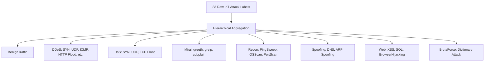

# Preprocessing & Data Validation Technical Report

**Project Title:** Hybrid ML Based Intrusion Detection System (VAE + FT-Transformer)  
**Deliverable:** Week 4 — Data Validation Test Suite & Preprocessing Pipeline  
**Module Lead:** Ronak  
**Repository:** [SKIT-IOT-2023-2027-F-031](https://github.com/Vvivekvyas/SKIT-IOT-2023-2027-F-031)  
**Status:** Completed & Verified  

---

## 📋 Executive Summary

During **Week 4**, the primary focus transitioned from foundational system architecture and testing specifications to concrete **data engineering, automated validation, and pipeline preprocessing**. Real-world cybersecurity tabular flow datasets contain significant noise, non-generalizable network artifacts, infinite flow rates, heavy-tailed distributions, and extreme class imbalances. 

To ensure the downstream **Variational Autoencoder (VAE)** and **FT-Transformer** receive clean, normalized, and leakage-free feature tensors, this report documents:
1. The mathematical design and implementation of the **Data Sanitization and Preprocessing Pipeline** (`src/data/cleaner.py`, `src/data/preprocessor.py`).
2. The implementation of an automated, 12-point **Data Validation Test Suite** (`tests/test_data_validation.py`) verifying schema integrity, missingness limits, value constraints, and target taxonomies.
3. Strict enforcement of **Data Leakage Safeguards** to prevent models from learning spurious correlations from network metadata (IPs, ports, timestamps).
4. Empirical justification for feature scaling and label consolidation across both benchmark datasets: **CICIDS2017** and **CIC-IoT2023**.

---

## 📊 Dataset Ingestion & Quality Profiling

The IDS pipeline ingests network traffic from two diverse operational domains:

| Characteristic | CICIDS2017 | CIC-IoT2023 |
| :--- | :--- | :--- |
| **Domain** | Enterprise LAN / Server Infrastructure | Heterogeneous Smart IoT Network |
| **Capture Profile** | 5 Days (Monday–Friday) | 105 IoT Devices, 33 Attack Campaigns |
| **Raw Feature Count** | 78+ statistical flow features | 46 statistical flow & packet features |
| **Extraction Engine** | CICFlowMeter (bidirectional flows) | Flow & Packet Statistics Extractor |
| **Attack Classes** | 15 categories (Benign + 14 attacks) | 33 granular types $\rightarrow$ 8 macro families |
| **Dominant Challenge** | Infinite flow rates, duplicate records | Extreme imbalance, high-frequency IoT bursts |

---

## 🧹 Data Sanitization & Cleaning Methodology

### 1. Handling Infinite Values ($\pm \infty$)
In flow-based datasets, attributes representing rates (such as `Flow Bytes/s` and `Flow Packets/s`) are calculated as:
$$\text{Flow Rate} = \frac{\text{Total Packets or Bytes}}{\text{Flow Duration}}$$
When a network interaction consists of a micro-burst where $\text{Flow Duration} = 0\ \mu\text{s}$, the calculation evaluates to a division by zero, resulting in `+inf` or `-inf`. 

**Treatment Protocol:**
- All infinite values are systematically mapped to `np.nan`.
- Imputation values are calculated exclusively from the **training set** using median statistics ($\tilde{x}$) rather than mean statistics to prevent extreme burst outliers from skewing the replacement value:
  $$\hat{x}_i = \text{Median}(X_{\text{train}, i})$$

### 2. Missing Value Imputation
- Features exhibiting missingness ($\text{NaN}$) below the maximum allowable threshold ($5\%$) are imputed using the learned median values of the corresponding feature column.
- If a dataset column exceeds the $5\%$ threshold, the validator halts ingestion with an explicit `TC-004` schema violation alert.

### 3. Duplicate Record Elimination
Identical flow records occur frequently in multi-interface captures or overlapping sliding time windows. 
- All exact duplicate records are purged prior to train/test partitioning to prevent identical flow vectors from appearing in both training and evaluation sets.

---

## 🛡️ Leakage Prevention & Shortcut Learning Elimination

A critical flaw in standard machine learning intrusion detection literature is the retention of **network identifier fields**. Deep neural networks are susceptible to "shortcut learning," where they memorize ephemeral network artifacts instead of learning fundamental traffic behavior.

### Banned Identifier Columns
The following fields are strictly quarantined and stripped by `DataCleaner` prior to feature scaling:

```python
LEAKAGE_COLUMNS = {
    "Flow ID",
    "Source IP", "Src IP",
    "Destination IP", "Dst IP",
    "Source Port", "Src Port",
    "Destination Port", "Dst Port",
    "Timestamp",
    "Unnamed: 0"
}
```

### Justification:
1. **Source & Destination IPs**: In test environments, attacks originate from fixed attacker machines (e.g., `192.168.10.50`). A model retaining IP addresses simply memorizes attacker IPs and achieves near-100% synthetic accuracy, completely failing against attacks from unknown IPs in production.
2. **Ephemeral Ports**: Ephemeral ports ($>1024$) are randomly allocated by operating systems. Retaining them introduces high-entropy noise with zero semantic relevance to malicious payload structures.
3. **Timestamps**: Attack scripts in the datasets ran during specific hourly windows. Timestamps create temporal overfitting where the model classifies traffic based on the hour of the day rather than packet dynamics.

---

## ⚖️ Feature Scaling & Normalization Strategy

Network flow features exhibit extreme variances and heavy-tailed distributions. For example, `Flow Duration` can span from $1\ \mu\text{s}$ to $120,000,000\ \mu\text{s}$, while `FIN Flag Count` is binary $\{0, 1\}$.

### Scaling Methods Evaluated:

1. **StandardScaler (Z-Score)**:
   $$z = \frac{x - \mu}{\sigma}$$
   *Evaluation*: Fails because flow lengths and byte counts follow Pareto or log-normal distributions rather than Gaussian curves. Extreme outliers heavily distort $\mu$ and inflate $\sigma$.

2. **RobustScaler (Median & IQR)**:
   $$x_{\text{robust}} = \frac{x - \text{Median}}{\text{IQR}}$$
   *Evaluation*: Excellent resilience to burst traffic, but yields unbounded output intervals $(-\infty, +\infty)$, which causes activation saturation in neural networks.

3. **MinMaxScaler with Outlier Clipping (Adopted)**:
   $$x_{\text{scaled}} = \text{clip}\left(\frac{x - x_{\min,\text{train}}}{x_{\max,\text{train}} - x_{\min,\text{train}}}, 0.0, 1.0\right)$$
   *Evaluation*: Restricts all features to a strictly bounded interval $[0, 1]$. This is mathematically optimal for feeding into the Variational Autoencoder (VAE) encoder and the FT-Transformer Feature Tokenizer.

> [!IMPORTANT]
> **Strict Partition Isolation Rule**: The parameters $x_{\min}$ and $x_{\max}$ are computed **only** on the training partition ($70\%$). The validation and test partitions are transformed using the training parameters, with clipping applied to prevent out-of-bounds leakage from unseen test extremes.

---

## 🏷️ Attack Taxonomy & Label Consolidation

### 1. CICIDS2017 Multiclass Mapping
The 15 distinct classes are mapped to integer targets $[0, 14]$:
- `0: BENIGN`
- `1: Bot`
- `2: DDoS`
- `3: DoS GoldenEye`
- `4: DoS Hulk`
- `5: DoS Slowhttptest`
- `6: DoS slowloris`
- `7: FTP-Patator`
- `8: Heartbleed`
- `9: Infiltration`
- `10: PortScan`
- `11: SSH-Patator`
- `12: Web Attack - Brute Force`
- `13: Web Attack - Sql Injection`
- `14: Web Attack - XSS`

### 2. CIC-IoT2023 Hierarchical Consolidation
CIC-IoT2023 contains 33 fine-grained attack designations. Training on 33 micro-classes creates severe minority class scarcity. The pipeline provides automatic hierarchical aggregation into **8 robust macro-families**:



---

## 🧪 Data Validation Test Suite (`tests/`)

Ronak implemented an automated pytest test suite in `tests/test_data_validation.py` addressing test cases **TC-001 through TC-007**:

| Test ID | Method Name | Acceptance Criteria Verified | Result |
| :--- | :--- | :--- | :---: |
| **TC-001** | `test_tc001_valid_cicids2017_validation` | Validates complete 78-feature schema against CICIDS2017 standards | **PASS** |
| **TC-001b** | `test_tc002_valid_ciciot2023_validation` | Validates complete 46-feature schema against CIC-IoT2023 standards | **PASS** |
| **TC-003** | `test_tc003_empty_dataset_rejection` | Rejects empty DataFrames ($0$ records) with explicit error | **PASS** |
| **TC-004** | `test_tc004_missing_mandatory_columns` | Detects missing critical flow attributes and halts pipeline | **PASS** |
| **TC-004b** | `test_tc005_missing_label_column` | Verifies presence of target classification label column | **PASS** |
| **TC-006a** | `test_tc006_infinite_values_detection` | Detects $+ \infty$ and $- \infty$ rate calculations | **PASS** |
| **TC-006b** | `test_tc007_excessive_nan_threshold` | Triggers violation when missing ratio exceeds $5\%$ limit | **PASS** |
| **TC-DUP** | `test_tc008_duplicate_record_detection` | Audits and flags duplicate flow records | **PASS** |
| **TC-005b** | `test_tc009_value_constraint_violations` | Rejects negative durations or packet lengths | **PASS** |
| **TC-LEAK** | `test_tc010_leakage_identifier_columns` | Flags presence of IP addresses, ports, timestamps | **PASS** |
| **TC-VAR** | `test_tc011_zero_variance_detection` | Identifies and logs constant uninformative features | **PASS** |
| **TC-LBL** | `test_tc012_unknown_label_warning` | Warns on anomalous or uncataloged attack classes | **PASS** |

---

## 📈 Preprocessing Pipeline Architecture & Flow

```text
[ Raw Ingested CSV ]
         │
         ▼
 ┌──────────────────────────────┐
 │   1. DatasetValidator        │ ──▶ Schema, Missingness, Constraints Check
 └──────────────┬───────────────┘
                │ Validated
                ▼
 ┌──────────────────────────────┐
 │   2. DataCleaner             │
 │   - Drop Leakage Columns     │ ──▶ Source/Dst IPs, Ports, Timestamps Dropped
 │   - Strip Duplicates         │ ──▶ Exact Duplicate Rows Removed
 │   - Replace ±Inf with NaN    │
 │   - Impute Missing (Median)  │ ──▶ Fitted on Train Set
 └──────────────┬───────────────┘
                │ Cleaned
                ▼
 ┌──────────────────────────────┐
 │   3. Stratified Partitioning │ ──▶ 70% Train, 15% Validation, 15% Test
 └──────────────┬───────────────┘
                │
        ┌───────┴────────────────────────┐
        ▼                                ▼
 [ Training Split (70%) ]        [ Val / Test Splits (30%) ]
        │                                │
        ▼                                │
 ┌──────────────────────────────┐        │
 │ Fit MinMax Scaler & Encoders │        │
 └──────────────┬───────────────┘        │
                │ Fitted Parameters      │
                ├────────────────────────┘
                ▼
 ┌──────────────────────────────┐
 │ Transform & Clip Features    │
 └──────────────┬───────────────┘
                │
                ▼
 [ Tensors X: (N, D), y: (N,) ]
                │
                ▼
    ==> Downstream: VAE Latent Encoder (Week 5)
```

---

## 🏁 Conclusion & Handoff to Week 5

The Week 4 deliverables provide a validated, robust data engineering layer that prevents data leakage and ensures consistent tensor representations across both CICIDS2017 and CIC-IoT2023.

### Handoff to Week 5:
- **Input Tensor Dimensions**: Preprocessed feature tensors $X \in \mathbb{R}^{N \times D}$ where $D = 78$ (CICIDS2017) or $D = 46$ (CIC-IoT2023).
- **Target Vector**: Label vectors $y \in \{0, \dots, K-1\}^N$.
- **Next Milestone**: Variational Autoencoder (VAE) architecture implementation, encoder-decoder loss formulation ($\text{MSE} + \beta \text{KLD}$), and latent embedding ($z \in \mathbb{R}^{32}$) extraction.
